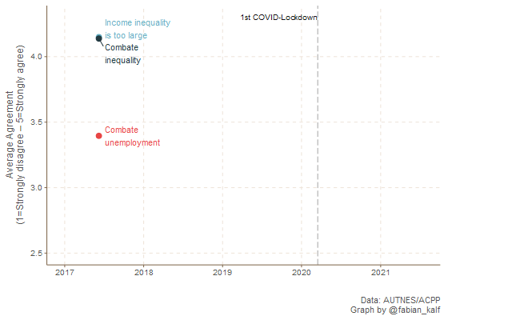

[← Back to Projects](../../projects.qmd)

**Tags:** COVID-19 · Survey research · Completed

[[Project Website]](https://viecer.univie.ac.at/coronapanel/) · [[Data]](https://doi.org/10.11587/28KQNS)

---

## Project Description

The Austrian Corona Panel Project is the largest social survey project to cover the COVID-19 pandemic in Austria. The panel covers nearly two years of the pandemic, fielding 27 survey waves with roughly 1,500 respondents each wave. The dataset contains over 1,000 variables and is publicly available at the Austrian Social Science Data Archive ([AUSSDA](https://data.aussda.at/dataset.xhtml?persistentId=doi:10.11587/28KQNS)). The project has been featured many times in Austrian media outlets.

I was part of the questionnaire design team responsible for quality control, evaluating the submissions to our call for question modules, and ultimately deciding which questions to field. In addition, I created an R Markdown file that creates longitudinal summaries of most variables included in the core questionnaire of the ACPP. I also authored or co-authored several short *Corona Blogs* (in German) on a number of different topics (e.g. inequality, tax preferences, home office). These blog posts and many more from my colleagues are accessible [here](https://viecer.univie.ac.at/en/projects-and-cooperations/austrian-corona-panel-project/corona-blog/).

Figure 1 displays one product of these blogs focussing on the change or rather the mesmerizing stability in average welfare state preferences in Austria (refer to the full blog post [here](https://viecer.univie.ac.at/corona-blog/corona-blog-beitraege/blog113/))

## Publications

Licia Bobzien, Fabian Kalleitner (2021). Attitudes towards European Financial Solidarity during the Covid-19 Pandemic: Evidence from a Net-Contributor Country. *European Societies*. [[DOI]](https://doi.org/10.1080/14616696.2020.1836669)

Bernhard Kittel, Fabian Kalleitner, David W. Schiestl (2021). Peers for the Fearless: Social Norms Facilitate Preventive Behaviour When Individuals Perceive Low COVID-19 Health Risks. *PLOS ONE*. [[DOI]](https://doi.org/10.1371/journal.pone.0260171)

Bernhard Kittel, Sylvia Kritzinger, Hajo Boomgaarden, Barbara Prainsack, Jakob-Moritz Eberl, Fabian Kalleitner, et al. (2021). The Austrian Corona Panel Project: Monitoring Individual and Societal Dynamics amidst the COVID-19 Crisis. *European Political Science*. [[DOI]](https://doi.org/10.1057/s41304-020-00294-7)

Fabian Kalleitner, David W. Schiestl, Georg Heiler (2021). Varieties of Mobility Measures: Comparing Survey and Mobile Phone Data during the COVID-19 Pandemic. *SocArXiv*. [[DOI]](https://doi.org/10.31235/osf.io/r78fk)
