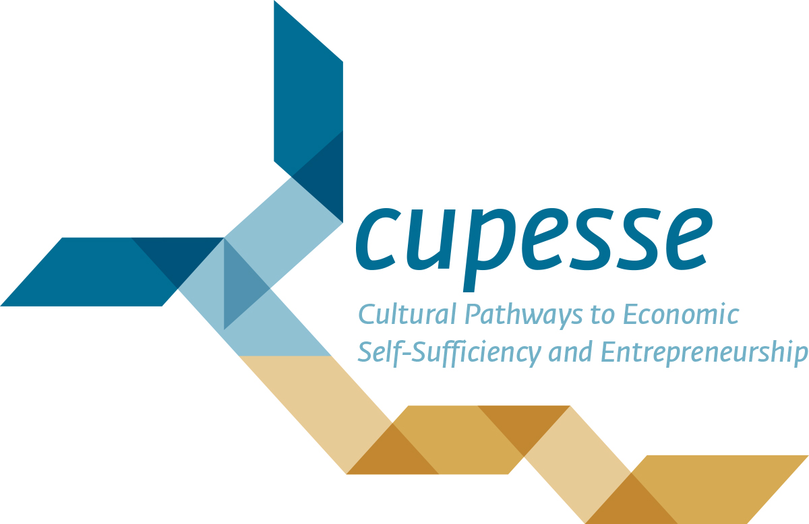
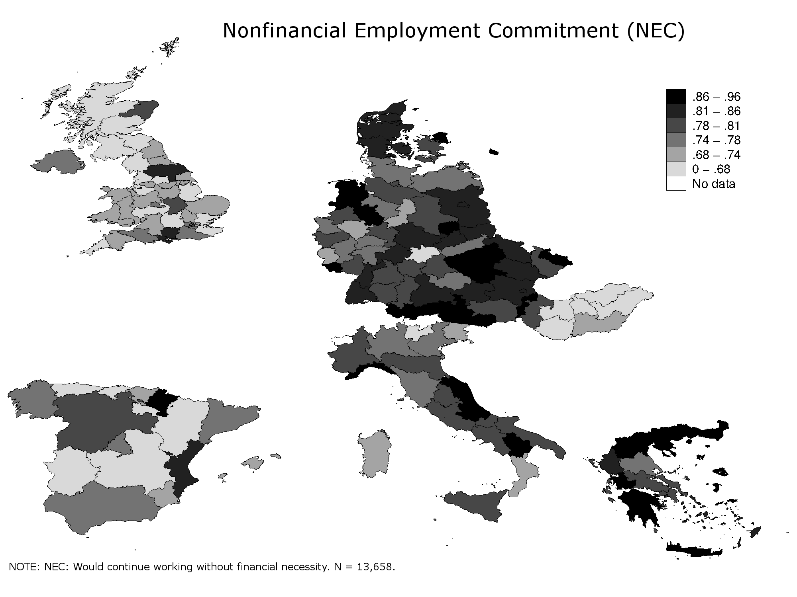

[← Back to Projects](../../projects.qmd)

**Tags:** Youth unemployment · Work values · Completed

---

## Project Description

*Cultural Pathways to Economic Self-Sufficiency and Entrepreneurship* was an EU-FP7-SSH funded project of 12 universities led by Jale Tosun from the University of Heidelberg. It aimed at **analysing youth unemployment in Europe** following the economic crisis. Besides publishing several papers and a book, it generated **qualitative as well as quantitative data from 14 countries** (Austria, Czech Republic, Denmark, Germany, Greece, Hungary, Italy, Spain, Switzerland, Turkey, and the United Kingdom). More details on the project can be found [here](https://cordis.europa.eu/project/id/613257). A video featuring some results is available on [YouTube](https://www.youtube.com/watch?v=Y_XNo48m3Mg).

I joined the project at its final stages and worked with the quantitative dataset analysing diverging patterns of work centrality in Europe. This work resulted in a [paper](../../publications.qmd) co-authored with Bernhard Kittel and Panos Tsakloglou. In it we highlight the diverse pattern of two dimensions of work centrality — the relative importance of work (especially in comparison to leisure) and nonfinancial employment commitment — across European regions. We link these two measures to the popular differentiation between intrinsic and extrinsic work benefits. Utilizing multilevel analysis, we show how strongly parents influence children's work values and point out macro-economic factors explaining regional differences in work centrality patterns across Europe. The dataset has been published and can be accessed [here](https://dbk.gesis.org/dbksearch/SDesc2.asp?DB=E&no=7475).

## Publications

Bernhard Kittel, Fabian Kalleitner, Panos Tsakloglou (2019). The Transmission of Work Centrality within the Family in a Cross-Regional Perspective. *The ANNALS of the American Academy of Political and Social Science*. [[DOI]](https://doi.org/10.1177/0002716219827515)
