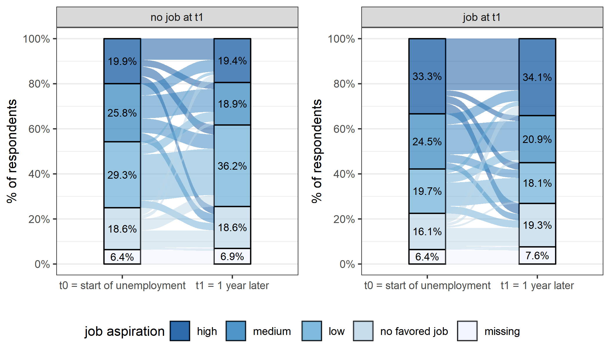

[← Back to Projects](../../projects.qmd)

**Tags:** Unemployment · ALMP · Field experiment · Completed (2014–2018)

---

## Project Description

The project JUSAW (*Jung und auf der Suche nach Arbeit in Wien* — Young and searching for a job in Vienna) existed from 2014 until 2018. It was led by Nadia Steiber, Monika Mühlböck, and Bernhard Kittel and cooperated with the Austrian Ministry of Labour, Social Affairs and Consumer Protection (BMASK) and the Austrian Public Employment Service (AMS). The project aimed to **study the heterogeneous consequences of becoming unemployed at an early age**. Study results have been featured in several Austrian media outlets (e.g. [FM4](https://fm4.orf.at/stories/2895430/)).

The project consisted of three main parts:

1. An initial quantitative survey at the beginning of an unemployment spell (N ≈ 1,500) combined with an accompanying qualitative study investigating the subjective experience of 36 unemployed young adults in Vienna.

2. A follow-up survey one year later of those participating in wave one. This panel survey data was also merged with governmental registry data about changes in labor market status (including registered job applications and participation in state-aided training programmes).

3. A field experiment featuring a small motivational nudge delivered via email to test the effect of information and externally induced self-reflection on job uptake and unemployment duration. We developed a survey using [soscisurvey.de](https://www.soscisurvey.de/) presenting either a short video, a survey, or both to roughly 20,000 individuals who had recently become unemployed in Austria. We find that **the treatment combining reflection and information reduces job search duration of young unemployed people with a low level of formal education**. The study has been featured as a [prime example](https://www.registerforschung.at/erfolgsbeispiele/beispiel_04/) of studies using governmental registry data in Austria (see the interactive graph below.)

In addition to this substantive finding, we also show methodologically that a nonmaterial incentive in the form of a short video does [not improve survey response rates or reduce response bias](../../publications.qmd).

<iframe title="Kaplan–Meier estimator..." 
  src="//datawrapper.dwcdn.net/ihhuY/5/" 
  scrolling="no" frameborder="0" 
  style="width: 0; min-width: 100% !important; border: none;" 
  height="578">
</iframe>

## Publications

Fabian Kalleitner, Monika Mühlböck, Bernhard Kittel (2022). What's the Benefit of a Video? The Effect of Nonmaterial Incentives on Response Rate and Bias in Web Surveys. *Social Science Computer Review*. [[DOI]](https://doi.org/10.1177/0894439320918318)

Monika Mühlböck, Fabian Kalleitner, Nadia Steiber, Bernhard Kittel (2021). Information, Reflection, and Successful Job Search: A Labor Market Policy Experiment. *Social Policy & Administration*. [[DOI]](https://doi.org/10.1111/spol.12754)

Monika Mühlböck, Fabian Kalleitner, Nadia Steiber, Bernhard Kittel (2022). Scarring Dreams? Young People's Vocational Aspirations and Expectations During and After Unemployment. *Social Inclusion*. [[DOI]](https://doi.org/10.17645/si.v10i2.5162)

