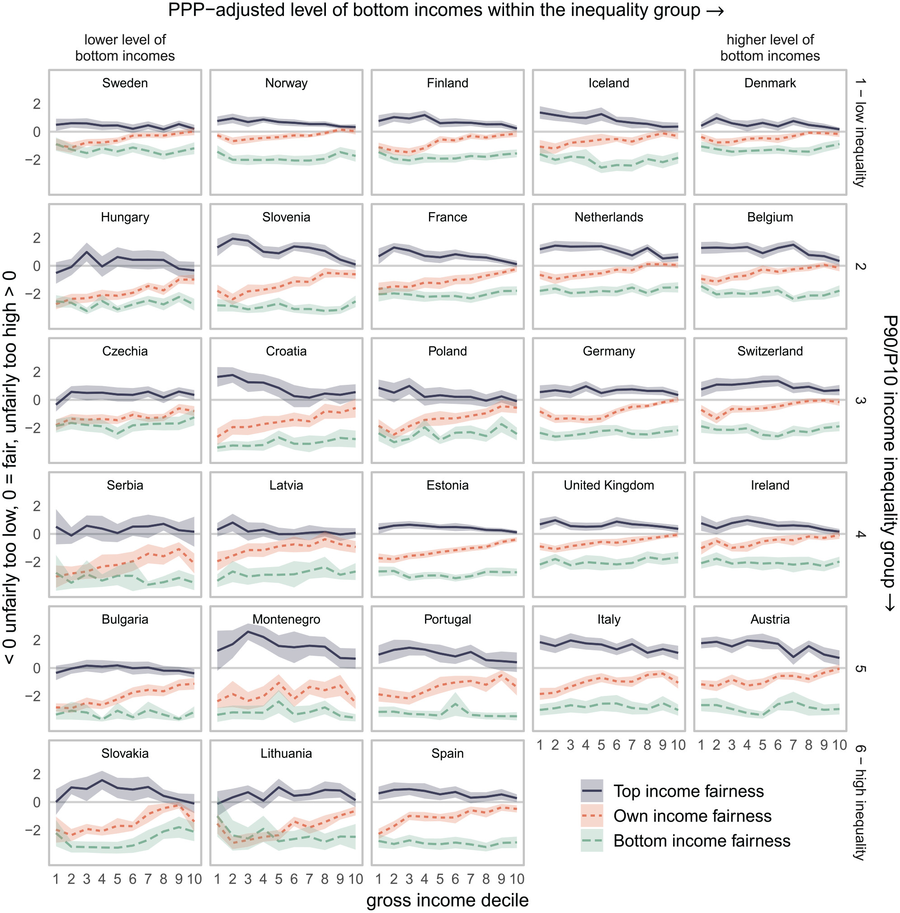

[← Back to Projects](../../projects.qmd)

**Tags:** Social justice · Ongoing

[[Project Website]](https://www.diw.de/de/diw_01.c.695628.de/projekte/perceptions_of_inequalities_and_justice_in_europe__pije.html)

---

## Project Description

The project aims to analyze how inequalities are perceived and evaluated across Europe, to identify the socio-economic factors shaping whether people regard inequalities as fair or unfair, and to examine how these evaluations influence social, political, and policy outcomes such as social cohesion, trust in democratic institutions, and political engagement.

The project was funded by the Leibniz foundation and ran from January 2020 to January 2025, primarily located at the [DIW](https://www.diw.de/de/diw_01.c.695628.de/projekte/perceptions_of_inequalities_and_justice_in_europe__pije.html). The project was headed by Stefan Liebig and Sandra Bohmann. I was part of the team from the University of Vienna and then from FU Berlin. Other collaboration partners included Guillermina Jasso (NYU), Thomas Hinz (University of Konstanz), Simone M. Schneider (Universitat Pompeu Fabra & MPI for Social Law and Social Policy), and others.

As part of the PIJE project, I examined how people perceive and evaluate inequality and the consequences these perceptions have, resulting in several publications:

In [The Inequity Z: Income Fairness Perceptions in Europe across the Income Distribution](../../publications.qmd), we introduced the concept of the "inequity Z" showing how fairness evaluations of own, top, and bottom incomes consistently reveal widespread consensus within countries and how these perceptions rise with actual inequality.

In [Subjective Inequity Aversion: How Unfair Inequality Affects Subjective Well-Being](../../publications.qmd), we demonstrated that perceptions of unfairness — especially regarding one's own and top incomes — are closely linked to lower subjective well-being, highlighting the importance of subjective evaluations of inequality in explaining individual well-being.

Finally, in *Informing about Gender Inequality: Beliefs about the Gender Pay Gap and Support for Gender Equality Policies*, we used novel survey experiments in Germany and the US to test whether providing information about the gender pay gap influences policy support. While we find that information shifts perceptions and fairness beliefs, these changes translate into only limited increases in support for policies to reduce the gender pay gap.

## Publications

Fabian Kalleitner, Sandra Bohmann (2023). The Inequity Z: Income Fairness Perceptions in Europe across the Income Distribution. *Socius: Sociological Research for a Dynamic World*. [[DOI]](https://doi.org/10.1177/23780231231167138)

Sandra Bohmann, Fabian Kalleitner (2023). Subjective Inequity Aversion: Unfair Inequality, Subjective Well-Being, and Preferences for Redistribution. *SocArXiv*. [[DOI]](https://doi.org/10.31235/osf.io/g8arw)
